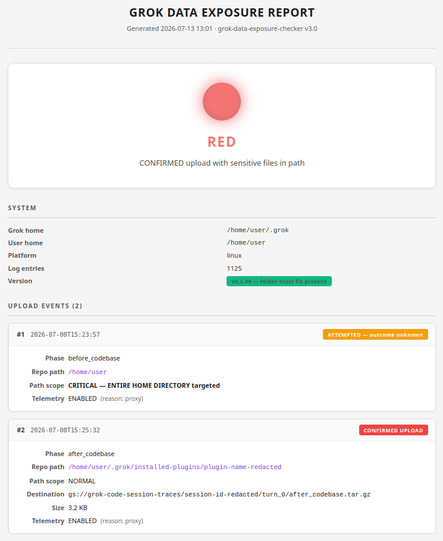
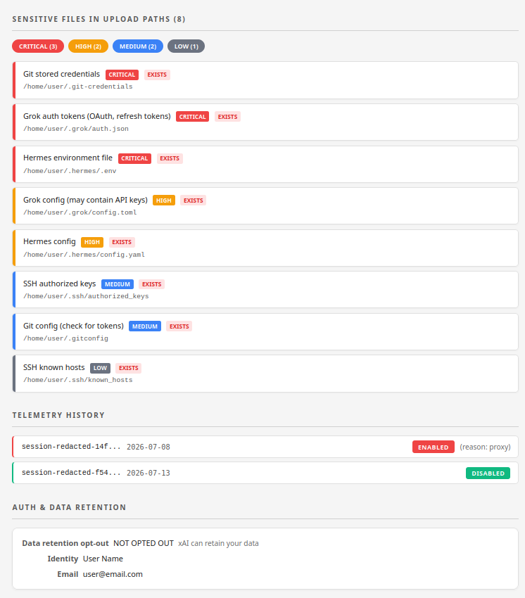
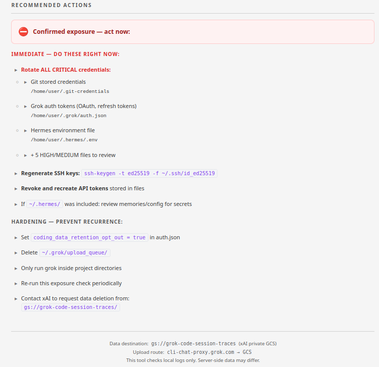

# Grok Data Exposure Checker

A standalone tool that detects whether the Grok Build CLI uploaded your data to xAI's servers without your knowledge.

## The Problem

Grok Build CLI (`grok`) silently packages and uploads workspace contents to xAI's Google Cloud Storage (`gs://grok-code-session-traces`). When launched from a home directory or broad path, it can attempt to upload your entire home directory — including SSH keys, API tokens, cloud credentials, and personal files.

This tool reads Grok's own log files to determine:
- Whether any uploads occurred
- What data was in the uploaded paths
- Whether sensitive files were exposed
- What you should do about it

## Quick Start

```bash
python3 scripts/grok_exposure_check.py
```

That's it. The tool generates a styled HTML report and opens it in your browser.

**Options:**

```bash
python3 scripts/grok_exposure_check.py --no-browser        # do not auto-open the report
python3 scripts/grok_exposure_check.py -o /path/report.html # write the report elsewhere
```

**Requirements:** Python 3.8+. No pip installs. No dependencies. No network access.

## What You'll See

The report is a styled HTML page with a visual traffic-light status:







The traffic-light status:

- **GREEN** — No upload events found. You're clear.
- **YELLOW** — Upload was attempted but outcome is uncertain. Rotate credentials as a precaution.
- **RED** — Confirmed data upload to xAI servers. Rotate credentials immediately.

The report includes:
- Every upload event found in the logs with timestamps and destinations
- Sensitive files that existed in the uploaded paths, sorted by severity
- Telemetry history (when uploads were enabled/disabled)
- Data retention opt-out status
- Specific recommended actions based on your exposure level

## How It Works

The tool reads `~/.grok/logs/unified.jsonl` (Grok's unified log) and looks for:

| Log Event | Meaning |
|---|---|
| `repo_state.upload.start` | Grok began packaging a directory for upload |
| `repo_state.upload.enqueued` | Upload confirmed with a GCS path (data reached xAI) |
| `trace.upload.decision` | Whether telemetry/uploads were enabled per session |
| `repo_state.upload.skip` | Upload was explicitly skipped (safe) |

It then cross-references the upload paths against a database of known sensitive file locations (SSH keys, cloud credentials, environment files, etc.) to determine what was at risk.

## Sensitive File Detection

Files are classified by severity:

- **CRITICAL** — Credentials allowing impersonation (SSH private keys, `.env` files, OAuth tokens, AWS credentials, database files)
- **HIGH** — Sensitive data worth protecting (API keys in config files, package manager tokens)
- **MEDIUM** — Config that may contain secrets (`.gitconfig`, SSH authorized_keys)
- **LOW** — Minimal risk metadata (SSH known_hosts)

Files checked include:
- SSH keys and configs (`.ssh/id_*`, `authorized_keys`, `config`)
- Cloud credentials (`.aws/credentials`, `.config/gcloud/`, `.azure/`, `.kube/config`)
- Environment files (`.env`, `.env.local`, `.env.production`)
- Auth tokens (`.grok/auth.json`, `.npmrc`, `.pypirc`, `.netrc`)
- Docker, Git, GPG, crypto wallets
- Hermes Agent config (`.hermes/config.yaml`, `.hermes/.env`)

## Cross-Platform Support

| Platform | Grok Home Location |
|---|---|
| Linux | `~/.grok` |
| macOS | `~/.grok` |
| Windows | `%USERPROFILE%\.grok` |
| Custom | Set `GROK_HOME` environment variable |

## Using With AI Agents

This tool works with any AI coding agent — Hermes, Cursor, Claude Code, Codex, Windsurf, Cline, etc.

When you ask an agent "check if Grok exposed my data," it should run the script and present the HTML report. See `AGENTS.md` for detailed agent instructions.

## Privacy

This tool:
- Reads only Grok's own metadata files under `~/.grok/` — the logs (`logs/unified.jsonl`), `auth.json`, and `version.json` — to determine what happened
- For everything else (SSH keys, cloud credentials, `.env` files, etc.) it checks **existence only** and never opens or reads their contents
- Does NOT transmit any data over the network
- Does NOT modify any files
- Generates the HTML report locally

**Note:** if `~/.grok/auth.json` contains your name/email, they appear in the report so you can confirm the affected identity. The report footer flags this — review before sharing the HTML.

## Limitations

- Only checks local logs — server-side data may differ
- Cannot determine with certainty if a `before_codebase` upload completed when no `.enqueued` event exists
- Cannot delete data from xAI's servers
- Sensitive file detection uses known patterns; novel file names may be missed
- The recursive scan for project-level secrets is bounded (depth and file count) for speed, so secrets in very deep or very large trees may be missed

## Background

The Grok Build CLI is xAI's autonomous coding agent (similar to Claude Code or Codex CLI). It launched in May 2026 as part of SuperGrok Heavy. In July 2026, wire-level analysis revealed that the CLI uploads workspace contents to xAI's cloud as part of its normal operation — including cases where users launched it from their home directory.

Key findings from the analysis:
- Uploads go to `gs://grok-code-session-traces` (private GCS bucket)
- The upload route is: your machine -> `cli-chat-proxy.grok.com` -> GCS
- The backend code service is at `code.grok.com`
- A fix in v0.2.90 addressed folder trust for home directories that are git repos
- Telemetry (and thus uploads) can be enabled/disabled server-side by xAI

## File Structure

```
grok-exposure-checker/
├── README.md                        This file
├── AGENTS.md                        Instructions for AI agents
├── LICENSE                          MIT
├── scripts/
│   └── grok_exposure_check.py       The standalone tool
└── docs/
    └── example-report.html          Example sanitized report
```

## License

MIT
